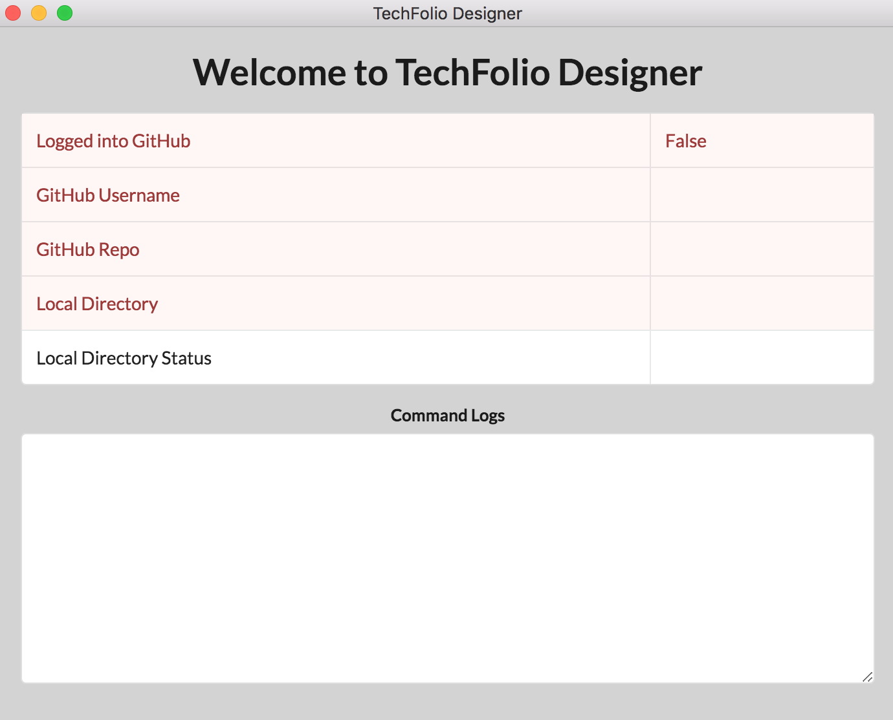
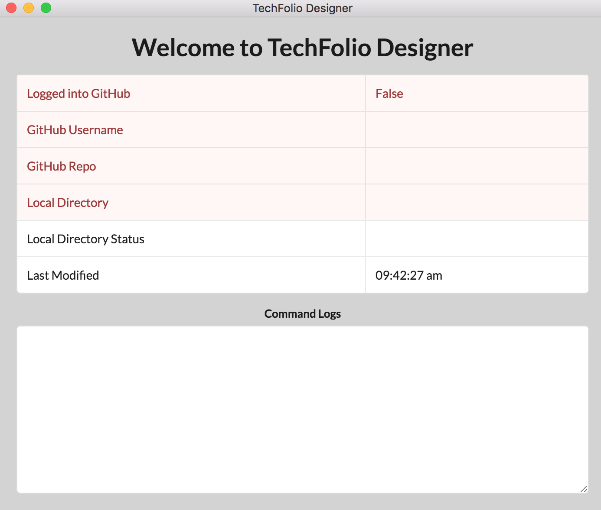
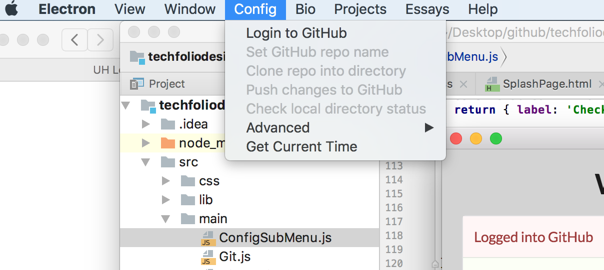
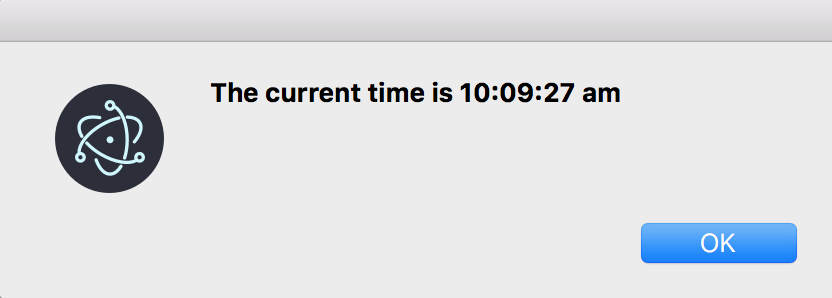
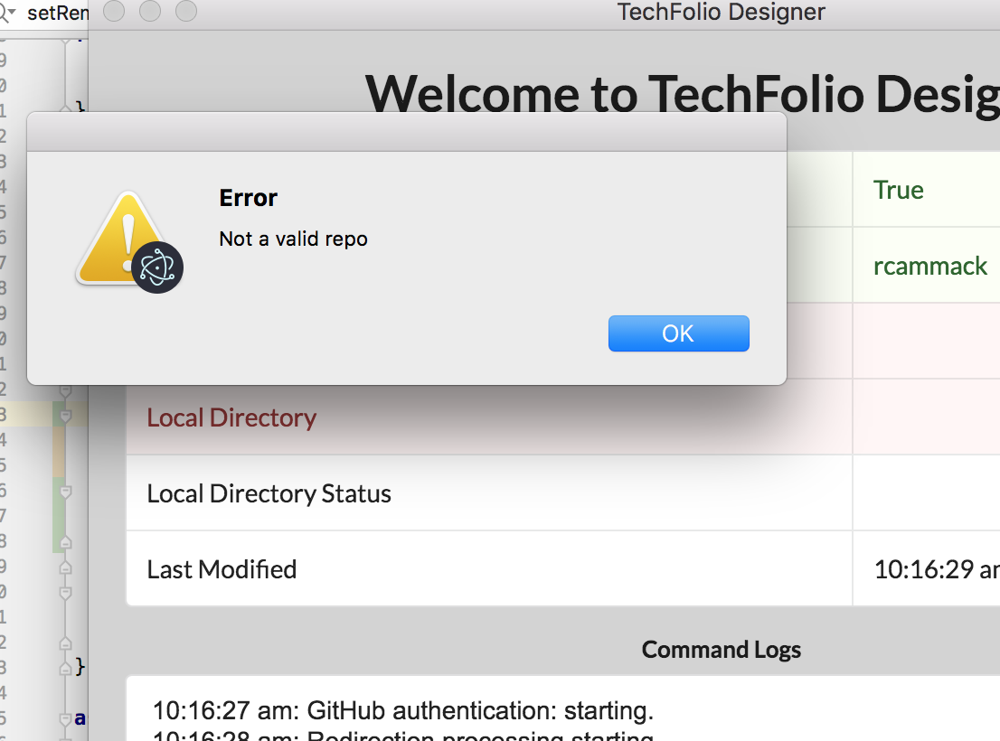
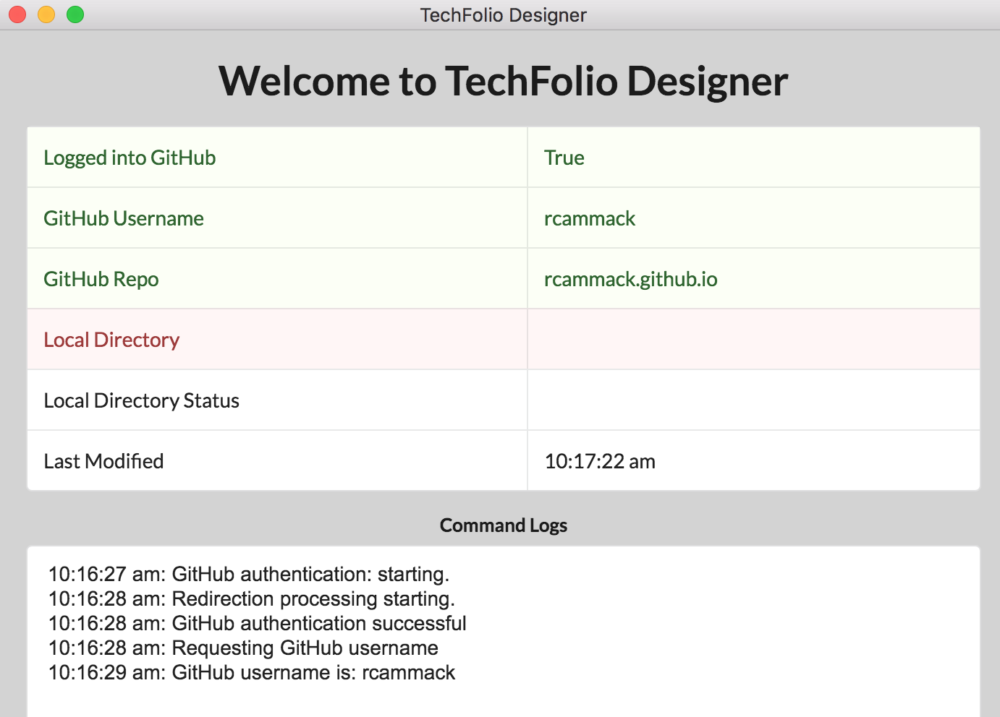
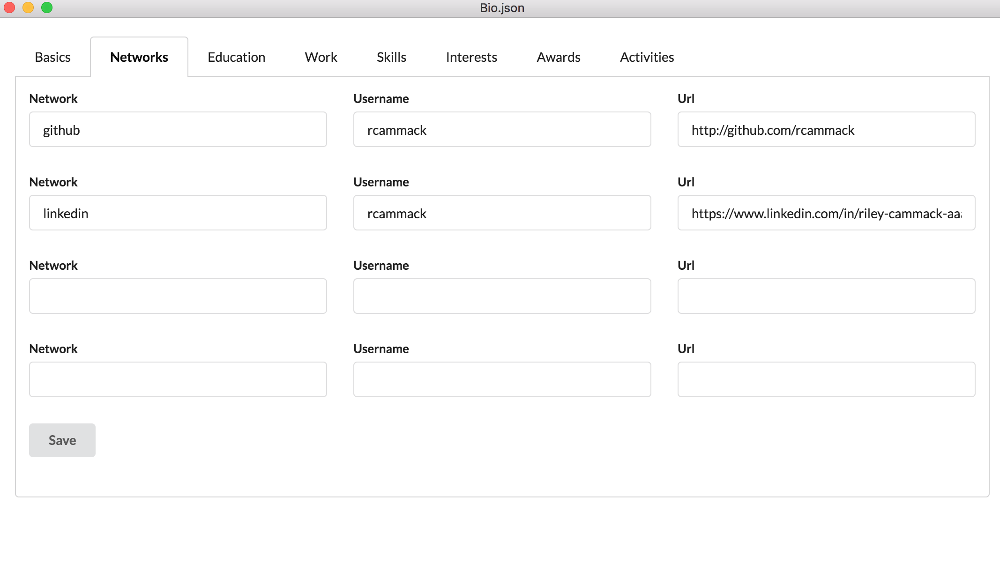
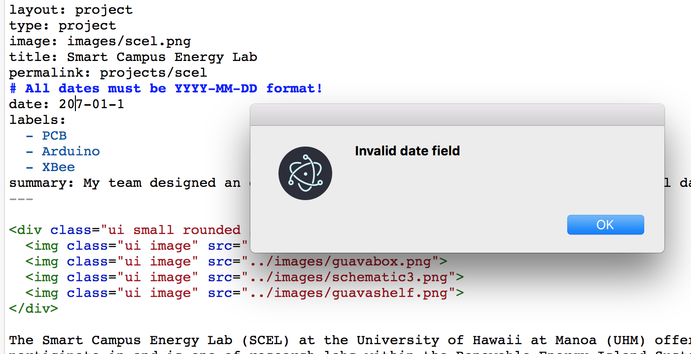

## My experience onboarding as a TechFolio Designer (TFD) developer-

Throughout this onboarding experience, I was able to successfully implement 6 simple TFD developer tasks described below: 

#### Change background color of Splash Page

* For this task, I changed the following file(s):
 ```src/splash/SplashPage.html```

* I did not encounter any problems with this simple task

* By completing this task, I became more familiar with the files associated with the Splash Page and how it is formatted/styled



#### Add "last modified" timestamp to Splash page

* For this task, I changed the following file(s):
 ```src/splash/SplashTable.jsx```

* I initially ran into the problem of importing 'moment' in order to grab the time; however, I ended up using the Electron format ```const moment = require('moment');```.

* This task helped me become more familiar with the Splash Page, more specifically the Splash Page Table. I also learned how to get and format the time using Moment.js



#### Add "Get Current Time" menu item to Config menu

* For this task, I changed the following file(s):
 ```src/main/ConfigSubMenu.js```

* The issue I had with this task was that I thought that the dialog box only needed to be passed the message as a string, but I quickly realized that it actually needed an object. I also had to restart the application in order for the changes to be reflected, which also caused some confusion.

* This task helped me learn where the files for the top menu of the desktop application were located and how each option is built. 





#### Add simple validation to Set GitHub Repo name

* For this task, I changed the following file(s):
 ```src/main/ConfigSubMenu.js```

* I did not encounter any problems for this task

* By completing this task, I learned where the functions dealing with the GitHub user and repository were and I also noticed a bit of Redux dispatching to the store.





#### Allow four networks in the Simple Bio Editor

* For this task, I changed the following file(s):
 ```src/simplebioeditor/SimpleBioEditorTabNetwork.jsx```

* I did not encounter any problems for this straight-forward task

* By completing this task, I learned how the Network tab of the Bio Editor works and how to update the JSON file for the bio data. 



#### Perform simple validation on Project and Essay Dates

* For this task, I changed the following file(s):
 ```src/techfolioeditor/TechFolioEditor.jsx```

* I encountered the most problems during this task because I could not get the notifier from Electron to work. I ended up solving this issue by using a dialog box to show the message instead. 

* By completing this task, I learned how to pull and validate data from the project and essay files. 

