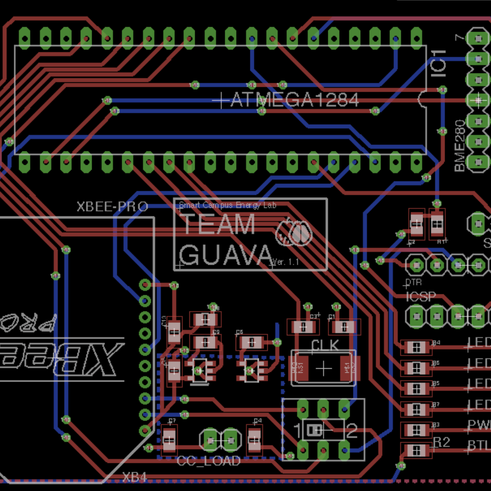
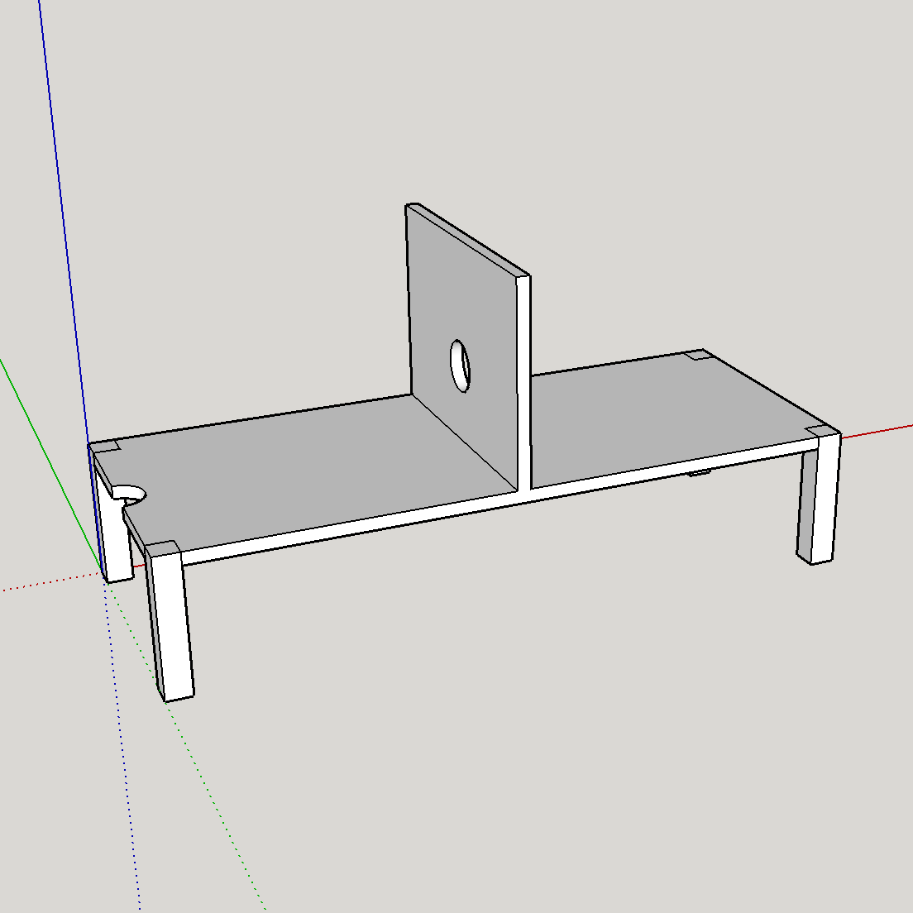

  
  
  
  

The Smart Campus Energy Lab (SCEL) at the University of Hawaii at Manoa (UHM) offers many projects for students to participate in and is one of research labs within the Renewable Energy Island Sustainability (REIS). Since the spring of 2017, I have participated in the SCEL weatherbox project whose objective is to design and develop various environmental sensor nodes that are low-cost and efficient to place on the roofs of UHM buildings. The weatherboxes are intended to collect meterological data through various sensors and relay the data via an XBee to help with the forecasting of renewable energy resources.  In order to implement the desired weatherbox, the project was composed of two main components which consisted of the printed circuit board (PCB) design, and the housing design. The project also included multiple meetings where each team would give a presentation on the progress of their design process. 

For this project, I was the lead PCB and housing designer for team Chocolate Cosmos in the spring of 2017, followed by the lead housing designer for team Guava in the fall of 2017. Both teams consisted of the same team members; however, the objectives of each team slightly varied. The team Guava project proved to be more difficult but also seeked to improve the existing weatherbox designs by integrating a new processor in the remodeled environmental sensor node. To approach the task of designing a PCB, we began by reproducing a generic schematic that other weatherbox teams used in the past. Then, using EAGLE, my team and I efficiently placed the parts on a small chip to be printed. Both semesters, I designed a weatherproof housing design to prevent rain from entering the box that would contain the PCB and battery while also providing ventilation to the components.  

From the experience, I was able to practice and learn more about hardware skills and PCB designing. I learned how to use the EAGLE and Google SketchUp applications. Not only did this project improve my technical skills but also advanced my communication, leadership, and presentation skills. Throughout each presentation, my public speaking skills improved greatly. Due to the many problems my team encountered throughout the experience, I also developed better problem solving skills.

You can learn more at the [SCEL Wiki](https://wiki.scel-hawaii.org/doku.php?id=weatherbox:start) or the [SCEL Website](http://scel-hawaii.org).

