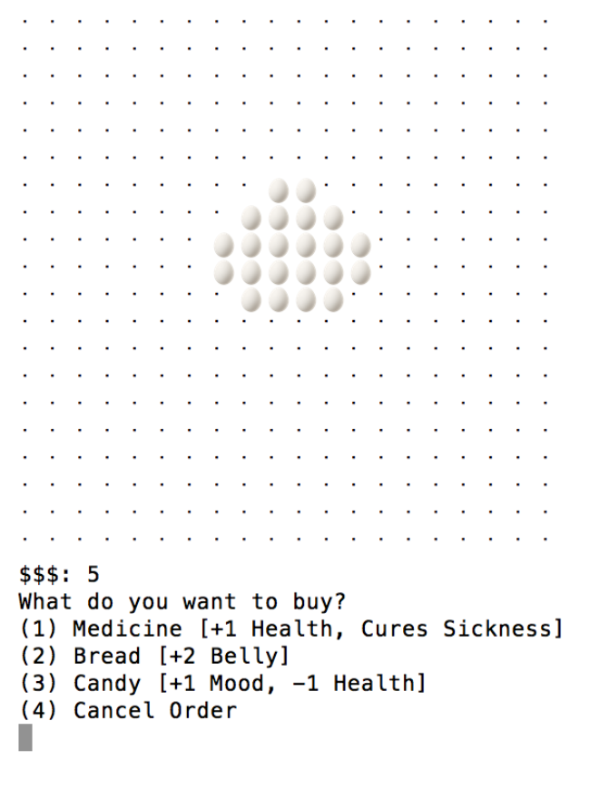

To start the game, you enter a name for your tamagotchi.  After a short animation, you are shown the status of your tamagotchi, which starts off healthy, full, and in a good mood along with a starting amount of $5, which you can later spend.  You are also given a menu of actions to take care of your pet.  Those actions include: feed tamagotchi, play a game, go to the store, check inventory, check status, and next day.  We implemented two mini-games: a memory game and a guessing game.

My role was primarily as a tester and debugger of our program while also providing conceptual ideas about the structure of our tamagotchi game.  I also provided the code for the guessing game minigame.  

Through this project, I was able to practice the object-oriented programming skills I developed that semester. We utilized structs to contain the details of each tamagotchi. Overall, the project was a fun experience.
 
Souce: <a href="https://github.com/kekupua/WDK-Homework/tree/master/Final%20Project"><i class="large github icon"></i>WDK-Homework/Final_Project</a>
