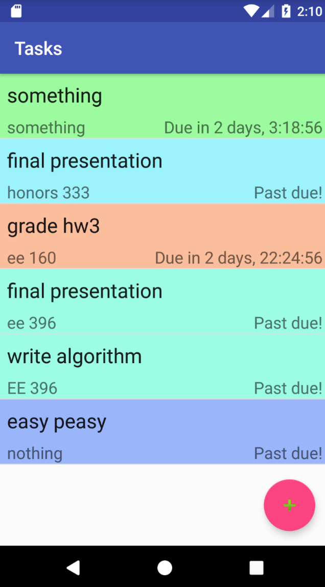

I designed and implemented an Android app in Java to keep track of school assignments and set reminders for due dates. The app uses an algorithm to list the tasks in order of a calculated priority based off of the due date, duration of assignment, and importance level set by the user. My team also created a database for the task inputs using SQLite

My main role was in developing an algorithm to calculate the priority of a task based on the due date, duration, and weight of the assignment. I also was the debugger and verified that our app was working properly at many intervals. 

Through this project, I was able to learn how to use the programming languages SQLite and Java. I also learned how to use Android Studios to design an app.

Source: <a href="https://github.com/rcammack/396-Android-App"><i class="large github icon "></i>396-Android-App</a>

