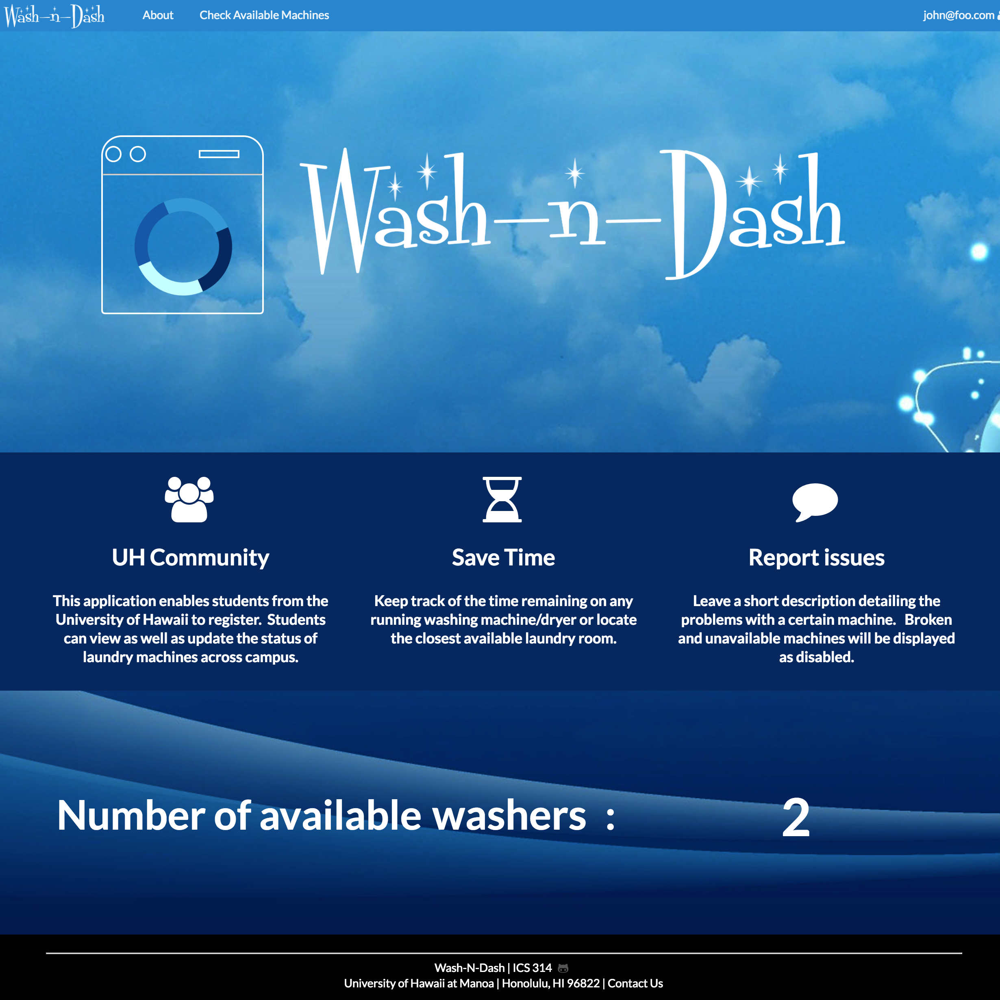

For this final project for ICS 314 (Software Engineering I), my team and I designed a web application using Meteor and MongoDB, deployed the app using Galaxy, and managed our work using GitHub projects and issues in order to design an app to keep track of the status of washing machines/dryers in laundry rooms across the UH campus.  The app was designed using React JavaScript library to build the user interface.  We built our app off of a generic multi-user Meteor template provided to us. 

When you come to [the deployed app](http://washndash.meteorapp.com/#/), you are taken to the landing page where you can read a description about the application and view the total number of available washers and dryers. Since the application is multi-user, you can then log in or sign up for an account. From there, you can go to the "check available machines" page now accessible through the navigation bar where you can filter and view the machines by location or machine type and view each machine's time remaining until available as well.  In addition, you can report an issue with an individual machine or view past reported issues from other users. If you log in as an admin user, you can also view a table of all of the machines and their corresponding information with an additional option to disable/enable a machine or add a machine. Another admin page allows you to manage the reported issues from all users. 

My role in this project included designing the landing page, helping design the "check availability" page, creating the report modal, and helping manage the MongoDB collections. You can view my precise contributions to this group project on [GitHub](https://github.com/wash-n-dash) via the project pages where we facilitated the work by assigning each other to various issue cards in a series of 3 different project milestones.  

Throughout this project, I was able to become more familiar with the programming languages JavaScript with Extensible Markup Language (XML) and HTML/CSS.  I also familiarized myself with the Meteor platform, and the MongoDB open-source database program. This project has also opened my eyes to some of the amazing features that GitHub has to offer such as GitHub pages, organizations, milestones, and project boards. 

Source: <a href="https://github.com/wash-n-dash"><i class="large github icon "></i>EE396-Android-Project</a>

