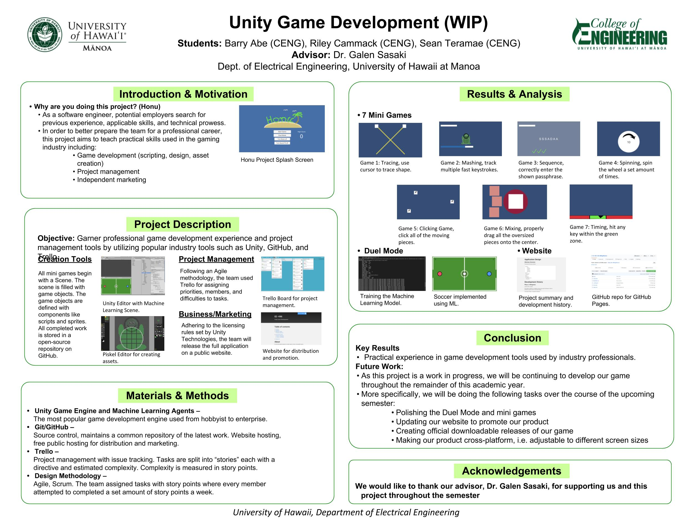

For my EE 496 Capstone project, my team and I created a game in [Unity](https://unity3d.com), a cross-platform game development engine used to build high quality 3D and 2D games. We chose this project in order to gain experience designing a product that incorporates various aspects of game development including project management and machine learning while also learning how to use popular tools, such as the Unity game engine, and programming languages, such as C#. 

## The Game:
Throughout our Fall 2018 semester, we created a single-player game that consisted of a player-versus-Agent duel mode incorporating [Unity's Machine Learning (ML) tools](https://unity3d.com/machine-learning) and a collection of consecutive mini games requiring nearly constant user interaction.  We initially focused on creating games that covered different features of Unity such as sequence, mashing, cutting, and other QTE (quick time event) games in order to familiarize ourselves with the game engine. The mini games we created include: “make the poke bowl”, “reel in the fish”, “hurricane proof the windows”, “help the turtle swim”, “type out the sequence”, “chop the log”, and “swat the flies”. 

In addition to our original mini game idea, we later came up with a “duel” or “showdown” game option for the user to play.  In this mode, the user would play a classic two-player game, such as air hockey, against an opponent which would be programmed using Unity’s ML tools.  Unity offers Agents, which can be tied to game objects and ‘learn’ what to do through experience.  The Agent would learn how to beat the user and win the game as the user interacts with the Agent, dynamically changing the difficulty level.  We completed the duel mode through the use of rewards functions, such as Unity’s Adversarial Self-Play rewards function.  Data collection and computation for this aspect of the game was managed using Tensorflow, an open-source machine learning framework. 

These two aspects of the game, (the mini games and the duel mode), are then shown on the game’s menu scene which pops up when the user opens the game.  The menu has start buttons for these two games, shows options to disable/enable the background music and sound effects, and displays the user’s high score.  

## The Project:

The primary programming language for scripting the game was C#, Unity’s default script language.  For project management tools, we used GitHub for collaboration purposes.  In our GitHub organization, there are two repositories: one for our game and one for our website hosted by GitHub Pages.  Another project management tool we used was Trello, a website and app used to delegate and keep track of different assignments.  

Our project design methodology followed Scrum, an Agile framework for managing our progress, to ensure effective teamwork.  Adhering to Scrum methodology, each task/issue was to be assigned a certain number of story points commensurate with the difficulty and length of each individual task.  These tasks included new features, decisions to be made, bugs to be fixed, and other things to be completed.  As we progressed throughout the semester, we would manually test our own code and our team members’ code while also performing user tests.  Then we created new issues to report bugs that we found.  Each Trello card described one issue to tackle and was in one of four columns indicating its status: backlog, in progress, blocked, or done.  We assigned ourselves issues to accomplish each week after discussing who should work on what aspect of our project.  Additionally, we ensured that every team member was involved in every phase of our project to try to split the work more evenly. 

Personally, the first thing I did for the project was complete a variety of Unity tutorials available through the Unity desktop application and Unity website.  Then I created the “reel in the fish” and “make the poke bowl” minigames as separate scenes. I also created a progress bar that overlays the mini games as well as music and sound effect objects and audio sources. After that, I focused on the scene management to control the loading and sequence of scenes while moving certain game objects, such as the progress bar and music objects, between scenes. Next, I researched the ML tools for the duel mode to see how we could utilize them in our duel mode. Another main task I was assigned was creating documentation of the game on our [GitHub page](https://ee-496.github.io/). For this, I took screenshots in our game, detailed the rules of our minigames/duel mode game, and wrote descriptions of our project to display on our product's website.  After we had a working game, we presented it at the poster session for the College of Engineering at UHM. Throughout this project, I was able to become more familiar with the programming language C#, game design, and the Agile design methodology. 

To read more about this project, see our [GitHub page](https://ee-496.github.io/).  

Source: <a href="https://github.com/EE-496/honu"><i class="large github icon "></i>Honu</a>

